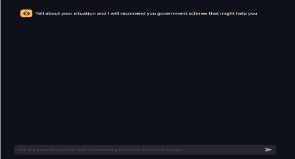

# NLP Minor Project: Bridging the Gap - Empowering Citizens with Government Welfare Schemes

## Project Overview

Welcome to our Natural Language Processing (NLP) minor project that addresses a critical issue in society - the lack of awareness about government welfare schemes. Governments often introduce numerous welfare initiatives, but a significant number of eligible individuals remain unaware of these opportunities. Our project aims to bridge this gap by leveraging cutting-edge technologies in NLP and machine learning.

## Problem Statement

**Challenge:** Government welfare schemes go unnoticed, leaving the intended beneficiaries uninformed and unable to avail themselves of the benefits.

**Objective:** Develop a conversational chatbot that can interact with users in a multilingual format and communicate information about various government welfare schemes in a casual or layman language.

## Solution Overview

Our proposed solution involves the creation of a chatbot powered by a Large Language Model (LLM) based on advanced machine learning techniques. This chatbot will serve as an interactive medium, allowing users to inquire about different welfare schemes in a user-friendly manner. The chatbot's responses will be drawn from a vast and meticulously curated database containing information about all government initiatives.

## Output

## Features

1. **Multilingual Conversations:** The chatbot is designed to facilitate conversations in multiple languages, ensuring that a diverse range of users can easily access information about welfare schemes.

2. **Casual and Layman Language Support:** The chatbot employs natural language processing to understand and respond to queries in a casual or layman language, making information more accessible to a wider audience.

3. **LLM-based Machine Learning Model:** The heart of our system is a Large Language Model (LLM) that has been trained on diverse datasets. This model enables the chatbot to understand and generate human-like responses, enhancing the user experience.

4. **Vast Database:** Our extensive database contains comprehensive information about various government welfare schemes, ensuring that the chatbot can provide accurate and up-to-date details to users.

## Getting Started

To interact with our chatbot, follow these steps:

1. **Access the Chatbot:** Fork the repo and then clone the project, further instructions will be provided once the project is done.

2. **Ask Questions:** Feel free to ask the chatbot about specific welfare schemes, eligibility criteria, application processes, or any related queries.

3. **Receive Informative Responses:** The chatbot will provide you with relevant and user-friendly information, helping you understand and benefit from government welfare schemes.

## Future Enhancements

We envision continuous improvement and expansion of our project. Future enhancements may include:

- Integration with additional communication channels (e.g., messaging apps).
- Real-time updates on changes to welfare schemes.
- Enhanced user personalization for tailored information delivery.

## Feedback

We welcome your feedback to improve our project. If you encounter any issues, have suggestions, or want to collaborate, please reach out to us via [payadikishan@gmail.com] or [[GitHub](https://github.com/kishan2k2/NLP-Project)].

Thank you for joining us on this journey to empower citizens with information about government welfare schemes!

[email]: payadikishan@gmail.com
[GitHub]: https://github.com/kishan2k2/NLP-Project

## Project Report

Look at the Methodology part to better understand the project workflow . 
[Download the PDF file](docs/NLP_project_report_pdf.pdf)
